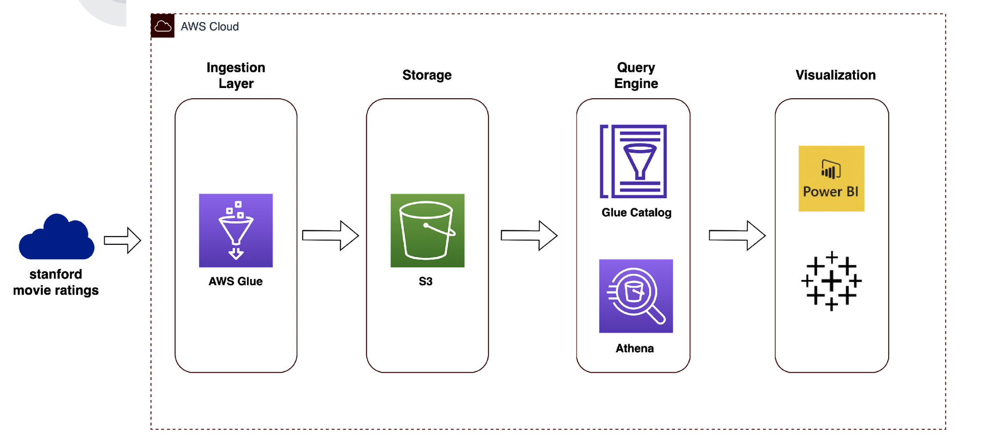

# Case Study Movie ratings data analysis
## Data Flow:

#### Clone the repository
`git clone https://github.com/sandeep-veerlapati/JET_case_movie_ratings.git`

### Workflow orchestration tool - Airflow
This is the file that generates airflow dag with pre defined tasks  - `airflow/dags/movie_ratings/DAG.py`

### How to build the deploy airflow dag?
- Copy the airflow/dags folder to airflow home folder

### Hive Table

Database - `Jet_case_analysis`
TableName - `movie_ratings`

|  **column Name** | **datatype**  | **Description**  |
|---|---|---|
| reviewerID  | string  | ID of the reviewer  |
|  asin | string  | ID of the product  |
| ratings  | float  | given rating by reviewer  |
| rating_time  | long  | datetime at which rating was given in epoch  |
| rating_dt  | date  | date of rating  |
| meta_asin | string  | ID of the product from meta movies   |
| title | string  | title of the movie  |
| year  | int  | year of the review   |
| month  | int  | month of the review   |

Create hive table using - `JET_case_movie_ratings/hql/CREATE_TABLE.hql`

### Download dataset

Download movie ratings and meta to local hdfs for further processing. Execute the script to setup the data - `sh /usr/local/bin/fetch_data.sh`

### Batch Ingestion

`spark-submit --num-executors 20 --executor-cores 6 /usr/local/bin/movie_ratings_ingestion.py --job_name movie_ratings --action ingest`
    
### Streaming ingestion

`spark-submit --num-executors 20 --executor-cores 6 /usr/local/bin/movie_ratings_ingestion.py --job_name movie_ratings --action stream`

* micro-batch processing
* Streaming deduplication with watermarking

### Athena analysis

The dataset generated by ingestion job answers the below questions -

* What are the top 5 and bottom 5 movies in terms of overall average review ratings for a given month?
* For a given month, what are the 5 movies whose average monthly ratings increased the most compared with the previous month?

